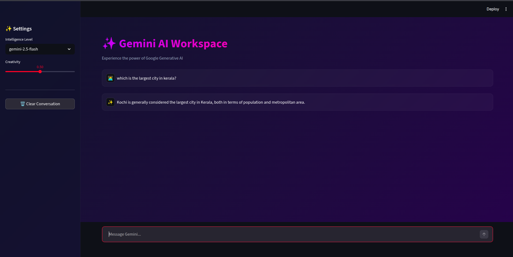

# Gemini AI Assistant

A sophisticated, interactive conversational AI application built with [Streamlit](https://streamlit.io/) and powered by Google's Gemini models via [LangChain](https://python.langchain.com/). This project provides a premium user interface to chat seamlessly with various Gemini models like `gemini-2.5-flash`, `gemini-2.5-pro`, and `gemini-2.0-flash`.

## Features

- **Interactive Chat Interface**: A beautiful, modern chat UI built using Streamlit's native chat elements.
- **Premium Aesthetics**: Custom CSS styling with dynamic background gradients, modern typography, and glassmorphism effects.
- **Contextual Memory**: Keeps track of the conversation history for seamless follow-up questions and more natural interactions.
- **Model Selection**: Switch between different Gemini intelligence levels directly from the sidebar.
- **Adjustable Creativity**: Tweak the model's temperature to control the creativity of the responses.
- **Easy Reset**: One-click button to clear the conversation history.

## Technologies Used

- **Python**: Core programming language.
- **Streamlit**: Web framework for building the interactive UI.
- **LangChain Core & Google GenAI**: Integration framework for building the LLM chain and managing conversational context.
- **Google Generative AI API**: The underlying large language models powering the assistant.
- **Dotenv**: For secure environment variable management.

## Prerequisites

Before you begin, ensure you have met the following requirements:
* You have installed Python 3.8+
* You have a Google Gemini API Key. You can get one from [Google AI Studio](https://aistudio.google.com/).

## Installation

1. **Clone the repository** (if applicable) or download the project files.
   ```bash
   git clone <repository-url>
   cd openai-langchain-chatbot-main
   ```

2. **Create a virtual environment** (recommended)
   ```bash
   python -m venv myenv
   source myenv/bin/activate  # On Windows use `myenv\Scripts\activate`
   ```

3. **Install the dependencies**
   ```bash
   pip install -r requirements.txt
   ```

## Configuration

1. Create a `.env` file in the root directory of the project.
2. Add your Google API Key to the `.env` file:
   ```env
   GOOGLE_API_KEY=your_google_api_key_here
   ```
   *(Note: The application will check for this key and alert you if it's missing.)*

## Usage

To start the application, run the following command from the project root:

```bash
streamlit run llm_app.py
```

This will launch the application in your default web browser (typically at `http://localhost:8501`).

## Project Structure

- `llm_app.py`: The main Streamlit application script containing UI logic, LangChain setup, and custom CSS.
- `requirements.txt`: List of required Python packages for the project.
- `.env`: (You create this) Environment variables file for your API keys.
- `myenv/`: Python virtual environment folder.

## Troubleshooting

- **API Key Error**: Ensure your `.env` file is in the same directory as `Llm_app.py` and correctly named. The application checks for `GOOGLE_API_KEY`.
- **Missing Dependencies**: Ensure you've activated your virtual environment before running `pip install -r requirements.txt`.
<p align="center">
  
</p>
